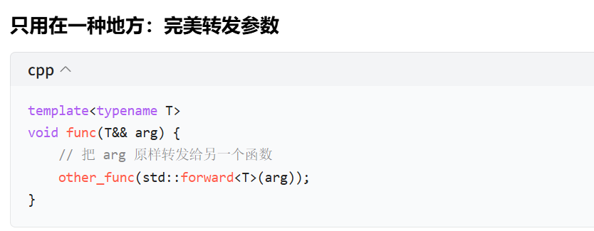
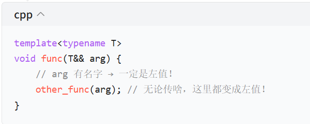
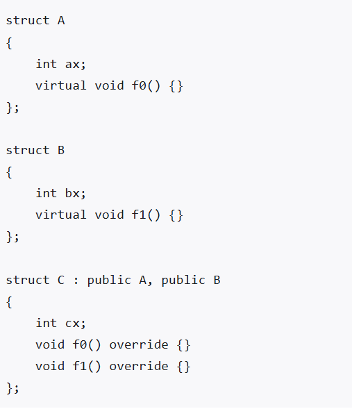
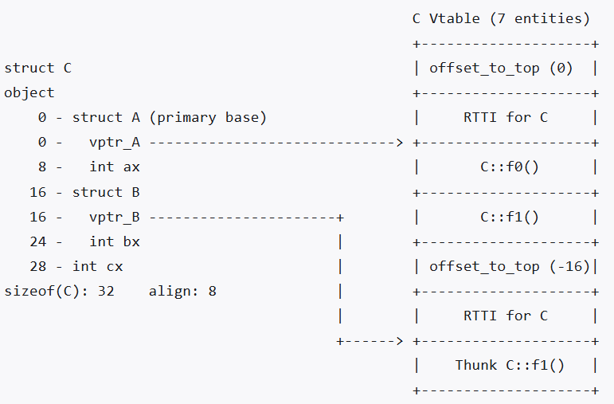

# C++八股
## 右值
### std::forward
完美转发，只配合万能引用使用（T&&）,本质和std::move一样，是强制类型转换


### 右值引用延长对象生命周期
只有 “绑定到临时对象(纯右值)的const左值引用/右值引用” 会延长生命周期，不是所有右值引用都能延长。
```
string&& f() {
    return string("abc");
}

string&& r = f();  // 悬空引用！
```
上面的例子不行
### 多继承下的对象模型


```
https://zhuanlan.zhihu.com/p/41309205
```
1. offset_to_top：指向第一个基类的偏移量
帮助this指针维护正确的地址，比如下面的代码，pb访问的应该是this + 8的地址
```
B* pb = new C;
pb->bx;   // 必须正确访问到 B 子对象的 bx
```
2. Thunk C::f1()：解决「调用 B 的虚函数时，this 指针偏移」问题
当你通过 B* 调用 f1() 时：
```
pb->f1(); // 实际调用的是 C::f1()
pb 指向的是 B 子对象的地址（偏移 16）
```
但 C::f1() 真正需要的 this 指针，是 C 对象的起始地址（偏移 0）
所以编译器会生成一个 Thunk 跳转函数：
先把 this 指针加上偏移量（这里是 -16，也就是 this -= 16），调整到 C 对象的起始地址
再跳转到真正的 C::f1() 函数执行
这个 Thunk 就是你图里看到的 Thunk C::f1()，它是编译器生成的 “胶水代码”，专门解决多继承中的 this 指针偏移问题。
### 虚继承的内存布局（很难，以后学）

## 内存对齐

