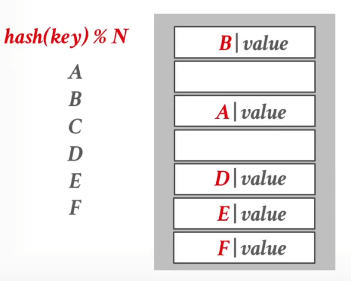
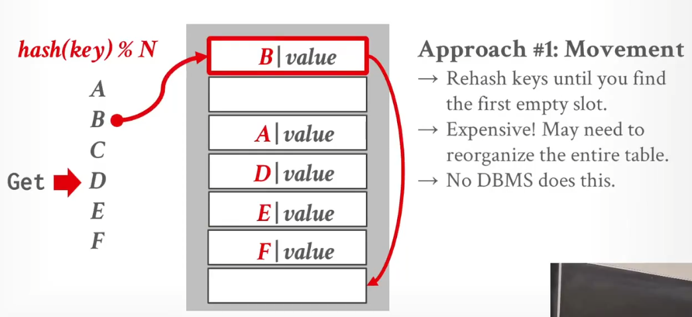
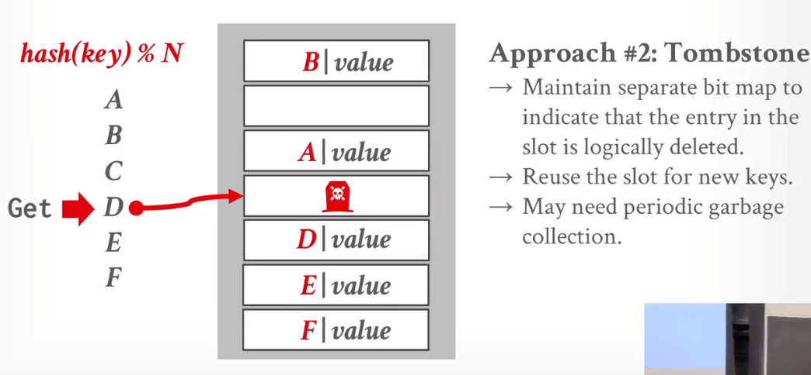
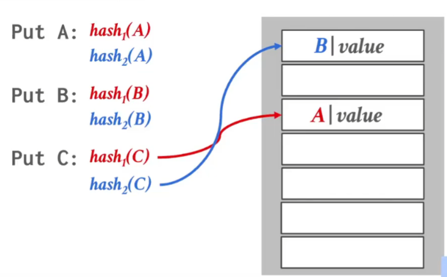
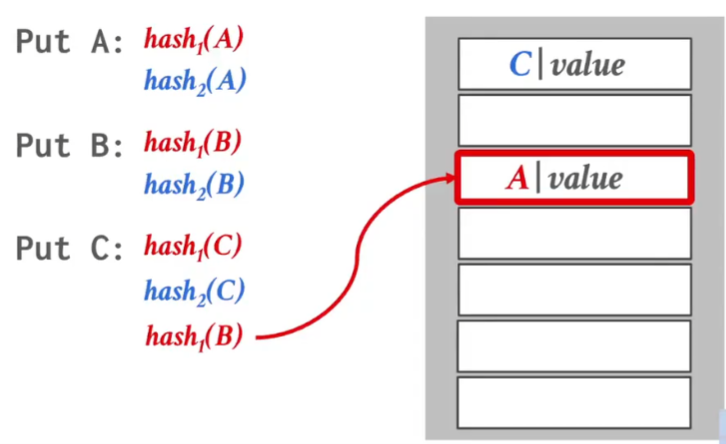
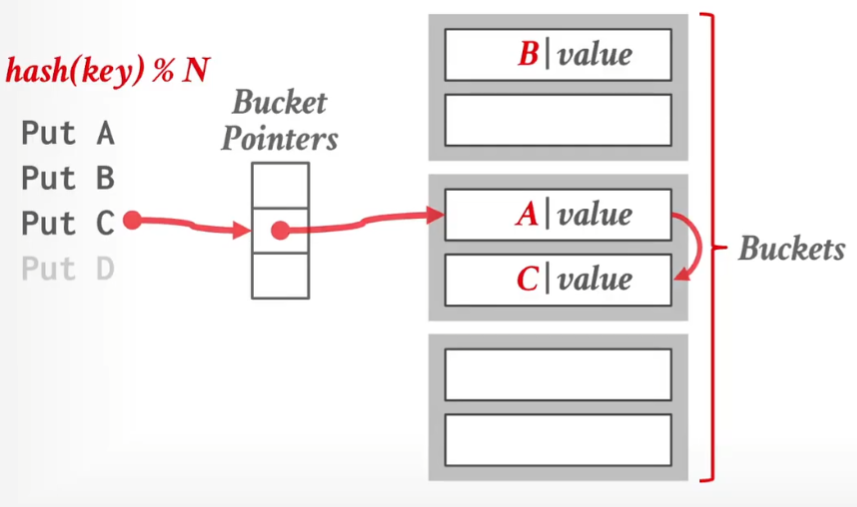

# DBMS和OS的纠葛
## 预先分配好内存
当使用DBMS时，总是需要摆脱OS的页面交换等机制，因为DBMS维护的页面之间是有逻辑关系的，可以优化，而OS不知道。
1. DBMS会申请一片较大的区域为Buffer Pool，目的是摆脱malloc
2. DBMS维护Buffer Pool自己页面的换入换出。**但是**需要注意，OS仍然会换入换出页面，即使他是Buffer Pool内的页面。所以一般DBMS独占整个系统。
> 为了防止上述灾难发生，成熟的数据库系统（如 MySQL InnoDB）和运维规范通常有两道防线，确保 Buffer Pool 牢牢锁在物理内存中：
>> - 第一道防线：软件层面的“锁定”
DBMS 会通过系统调用告诉操作系统：“这块内存非常重要，绝对不允许换出”。
1.  mlock() / mlockall()：MySQL 在初始化 Buffer Pool 时，会尝试调用 mlock() 系统调用。这会将 Buffer Pool 对应的虚拟内存地址锁定在物理内存中。只要锁定了，Linux 的 kswapd 线程在扫描内存时，会直接跳过这些页，无论内存多紧张都不会把它们 Swap 出去。
2. O_DIRECT：虽然主要用于绕过 OS 的 Page Cache，但它配合内存分配策略，也减少了 OS 对这块内存的干预能力。
>> - 第二道防线：运维层面的“隔离”
1. 正如你之前的笔记所提到的，我们会配置操作系统参数。
vm.swappiness = 0 (或 1)：在 Linux 中，这个参数控制内核使用 Swap 的倾向。设置为 0 或 1 意味着“除非发生内存溢出（OOM），否则尽量不要使用 Swap”。
2. 独占资源：通常数据库服务器会预留足够的内存给 OS（例如 20%），剩下的全给 Buffer Pool，确保物理上就不会触发 Swap 机制。
## 不要使用mmap
对于数据库文件，直观想法是mmap映射到内存，然后直接读取，但是这就把Page的控制权交给OS。

**文件映射mmap**
``` C++
int fd = open("test.txt", O_RDWR); // 1. 先打开文件获取 fd
// 2. 传入 fd
void *addr = mmap(NULL, 4096, PROT_READ | PROT_WRITE, MAP_SHARED, fd, 0);
```
**匿名mmap**
``` C++
// 直接传入 -1，并加上 MAP_ANONYMOUS
void *addr = mmap(NULL, 4096, PROT_READ | PROT_WRITE, MAP_SHARED | MAP_ANONYMOUS, -1, 0);
```
应当通过read，将对应文件的部分offset（Page），读取到进程地址空间的对应区域。

# Page Layout
## Turple-Orientation Storage

## Index-Orientation Storage

## Log-Record Storage

# ARC算法
## 

# 即使虚拟地址连续，物理地址也不一定连续

# Hash
## 静态Hash
需要DBMS预先知道Key的范围，即想存入的数量。
>> 以下都是解决冲突的策略
### Linear Probe Hashing
Hash表中要存Key以及Value，让发生Hash冲突时，可以对比下一个槽位是否空缺。(但是Key和Value要是定长的)
当装载因子过高，会导致冲突增加。需要创建新表，将旧的全部迁移到新表中。

#### 发生删除时
##### Movement
开销很大

##### Tombstone
开销小。以下图为例，删除了D之后，如果我访问D，知道表中第二个空位，直接返回空值。


### Cuckoo Hashing
运用多个Hash函数，当两个都发生冲突时，他会把其中一个原主赶走。

被赶走的，继续hash，从（除了被赶走的位置）其他位置开始，继续Hash。以此类推。

**实际上，Linear Probe Hash 非常快**
>> 以上都是解决冲突的策略
## 动态Hash
>> 以下都是动态调整Hash表的策略
### Chained Hashing

### Extendible Hashing
Chained Hashing的改进
  
### Linear Hashing
特别神奇的Hash方式.....
>> 以上都是动态调整Hash表的策略