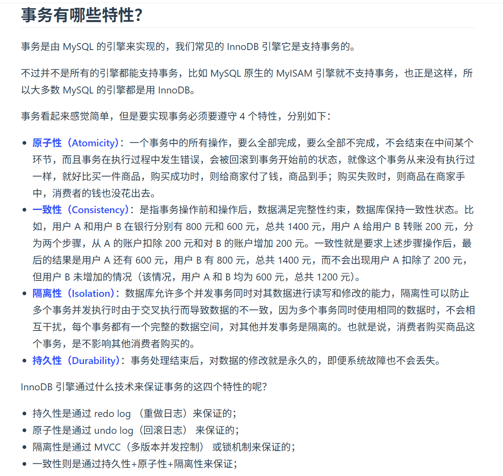
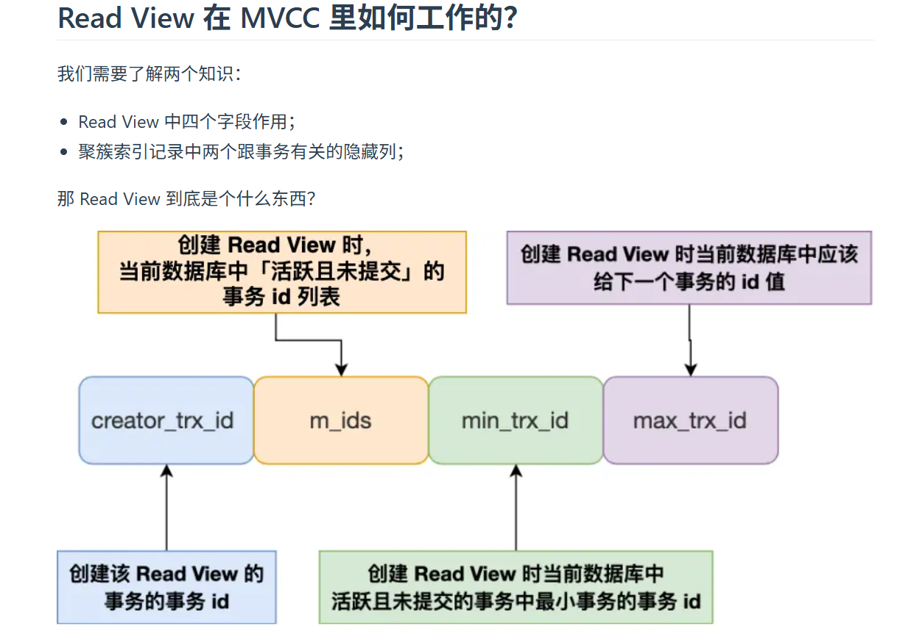
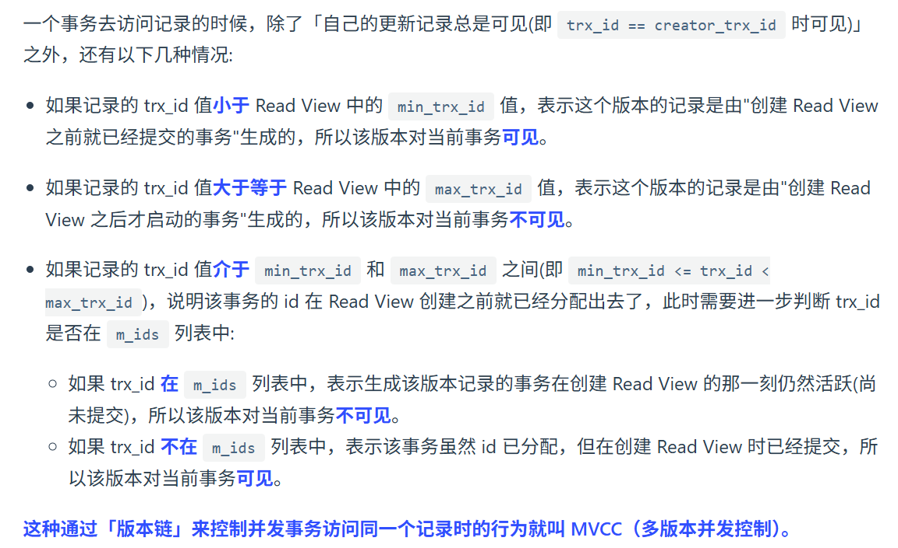
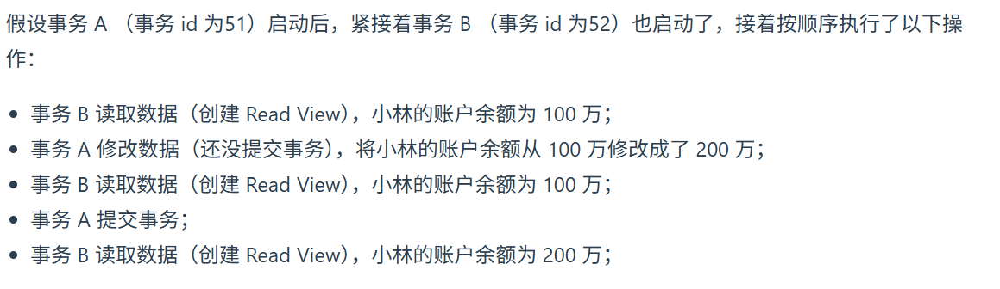
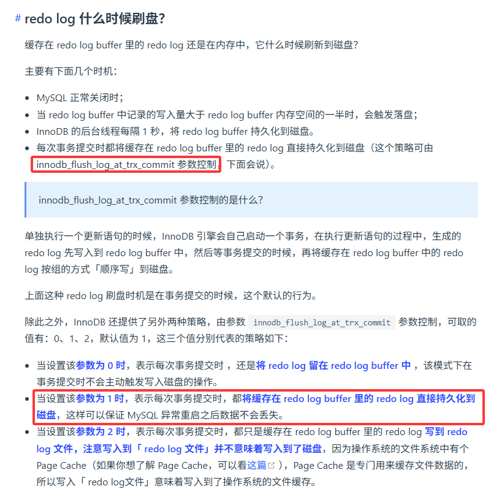
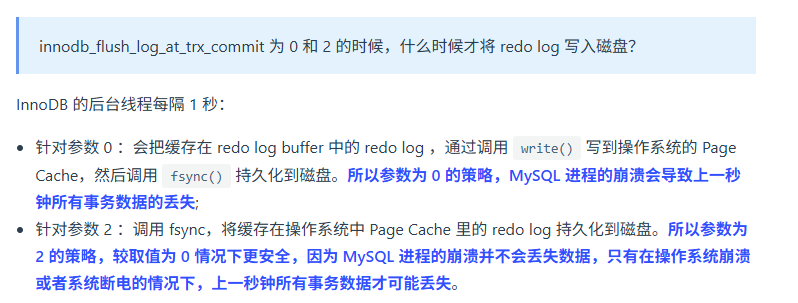
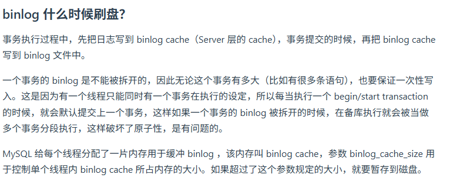
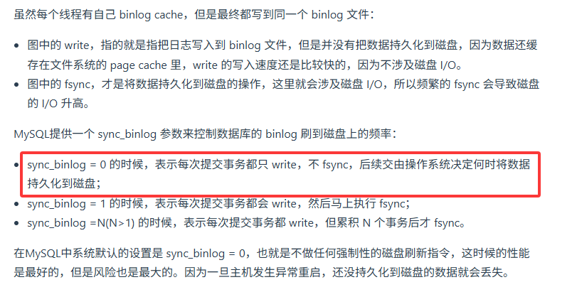

# Mysql八股
## 全表扫描
指的是按照主键顺序扫描表中的所有数据
## 覆盖索引
指的是SELECT中的字段和索引中的字段完全一致，不需要再查询表中的其他字段
## Innodb引擎对Page不记录row count
如果要记录Page的row count，需要表级索引
## 事务隔离

## MVCC
只有快照读（普通SELECT）才会生成Read View，其他读取操作不会生成Read View
### 快照读
启动事务时生成一个Read View，然后整个事务期间都用这个Read View
### 可重复读
启动事务时生成一个Read View，然后整个事务期间都用这个Read View
### 读提交
每次读取数据时，生成一个Read View

## 锁
## 全局锁
## 表级锁
### 意向锁
一、意向锁到底是什么？
意向锁是 InnoDB 引擎的一种表级锁，分为两种：
意向共享锁（IS）：表示「我要给表中某几行加共享锁」
意向独占锁（IX）：表示「我要给表中某几行加独占锁」
它本身不限制行锁，而是给表加一个 “标记”，告诉其他事务：
「我已经在这张表的某些行上加了行锁，别随便给整张表加锁」。
二、为什么要有意向锁？（核心目的）
如果没有意向锁，会出现一个效率问题：当你想给整张表加独占锁（比如 lock tables ... write）时，数据库必须遍历表中所有行，检查每一行有没有被其他事务加了独占锁，确认没有才能加表锁。
如果表很大，遍历所有行非常慢。
有了意向锁之后，就变成了：
事务 A 要给某行加独占锁 → 先给表加 意向独占锁（IX）
事务 B 想给整张表加独占锁 → 只需要看一下表上有没有 IX/IS 锁
有 → 说明表中已经有行锁，不能加表锁
没有 → 可以直接加表锁，不用遍历每一行
所以，意向锁的核心目的就是：快速判断表中是否存在行锁，避免遍历所有记录，提升加表锁的效率。
三、意向锁的规则与冲突关系
1. 什么时候会自动加意向锁？
InnoDB 会在这些操作中自动加意向锁，你不需要手动写：
执行 select ... lock in share mode → 先加 IS（意向共享锁），再加行共享锁
执行 select ... for update / update / delete / insert → 先加 IX（意向独占锁），再加行独占锁
普通 select 快照读：不加任何锁（走 MVCC）
2. 意向锁和其他锁的兼容性
关键结论：
意向锁之间不会冲突（IS 和 IX 之间可以共存）
意向锁和行锁也不会冲突（IS/IX 和行级的 S/X 锁互不影响）
意向锁只和表级的 S/X 锁冲突
## Mysql如何加行级锁？

### Insert加锁（未理解）
## 日志
### UndoLog
事务回滚（原子性），MVCC
### RedoLog
崩溃恢复（持久性），记录未落盘的日志，并不是全量的，当某些修改数据落盘后，对应的Log会被删去

### BinLog
记录所有修改操作的日志，用于主从复制，数据恢复
### 两阶段
#### RedoLog落盘时机
RedoLog和UndoLog记录的不一定是整个事务的记录

针对innodb_flush_log_at_trx_commit为0和2时：

#### BinLog落盘时机
BinLog记录的是事务的完整记录

#### RedoLog和BinLog的同步
Prepare和Commit
如果只有RedoLog记录，没有BinLog记录，那么回滚该记录