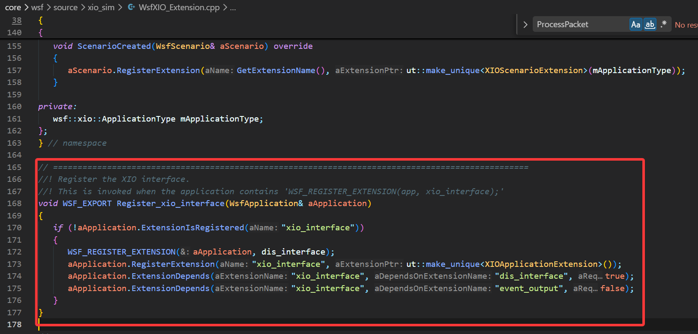
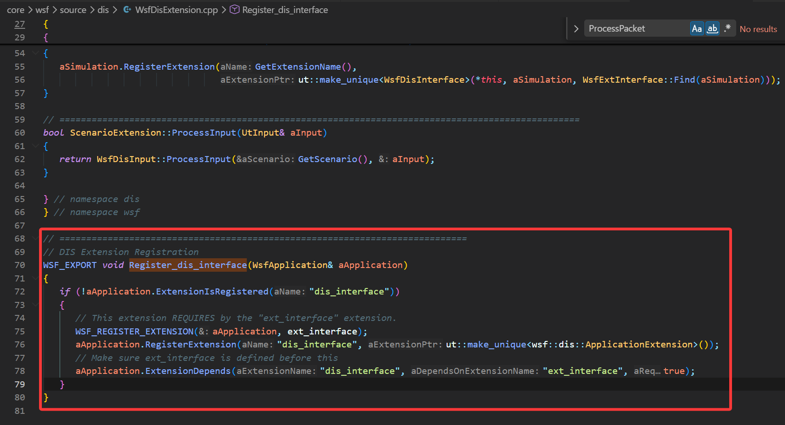
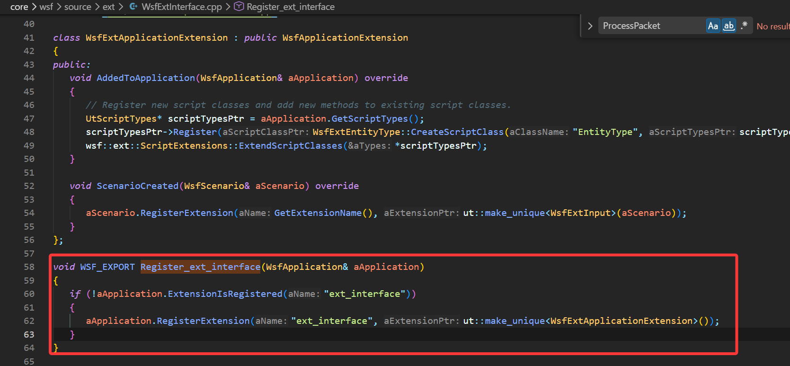
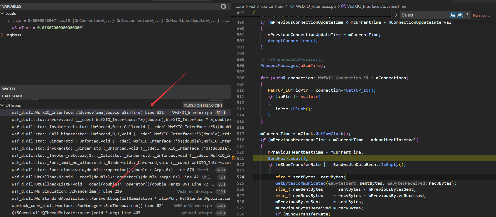

# AFSim
## 分布式仿真
### DIS和XIO
下面按“接收 → 处理 → 发送”的顺序，把 **DIS** 和 **XIO** 两条链路分别串起来（分布式场景里通常两者并行存在）。

#### **DIS：实体状态同步链路**

- **接收（网络 → PDU 对象）**
  - UDP Socket 收包后写入 GenIO 的接收缓冲：`GenUDP_IO::Receive` 会重置接收缓冲并调用 `ReceiveBuffer(...)` 把数据读进缓冲区（[GenUDP_IO.cpp#L42-L61]）。
  - DIS 的 UDP Device 从 GenIO 缓冲中取数据，够一个 PDU 就解析：`WsfDisUDP_Device::GetPdu` 里调用 `mGenIOPtr->Receive(0)`，然后 `DisPdu::Create(*mGenIOPtr, aPduFactoryPtr)` 生成具体 PDU（[WsfDisUDP_Device.cpp#L126-L158]）。

- **处理（PDU 对象 → 仿真对象/状态）**
  - 每个仿真步由 `WsfDisInterface::AdvanceTime` 拉取并处理所有待处理 PDU：过滤后直接调用 `pduPtr->Process()`（[WsfDisInterface.cpp#L1203-L1275]）。
  - 以最关键的 Entity State 为例：`WsfDisEntityState::Process()` 会
    - 忽略影子站点（`cSHADOW_SITE`）的 PDU；
    - 查本地是否已有对应实体；没有则创建外部平台，有则更新平台状态（[WsfDisEntityState.cpp#L68-L134]）。
  - “新实体 → 本地外部平台（你说的 Shadow/外部实体落地）”的核心入口是 `WsfDisInterface::AddExternalPlatformP`：选择平台类型、创建平台、必要时剥离组件、挂 `WsfDisMover`，然后 `Simulation.AddPlatform(...)`（[WsfDisInterface.cpp#L506-L646]）。
  - “ShadowPlatform（调试影子）”是可选逻辑：满足 shadow 配置时 `AddShadowPlatform(...)` 额外创建 `_shadow` 平台并设置 `cSHADOW_SITE`）。

- **发送（仿真状态 → 网络）**
  - 发送最终落在 Device 的 `PutPduP`：设置时间戳/仿真时间，`aPdu.Put(*mGenIOPtr)` 序列化进发送缓冲，然后 `mGenIOPtr->Send()` 发 UDP 包（[WsfDisUDP_Device.cpp#L160-L174]）。
  - 触发“什么时候发”通常是：心跳、阈值（位置/姿态变化）、以及特定事件（开火/爆炸等）。具体策略在 `WsfDisPlatform/WsfDisInterface` 的更新逻辑里决定，然后丢给 Device 发。

#### **XIO：AFSIM 内部生态通信链路（心跳发现 + TCP/UDP 数据）**

- **接收（网络 → XIO Packet 对象）**
  - XIO 在 `Initialize` 里启动连接管理（监听 TCP、建立 UDP 连接等）（[WsfXIO_Interface.cpp#L155-L192]）。
  - UDP/Broadcast/Multicast 目标连接通过 `ConnectToTarget` 建立：内部创建 `GenUDP_IO`，包装成 `PakUDP_IO`，交给 `mThreadedIO` 异步收包（[WsfXIO_Interface.cpp#L194-L273]）。
  - 每帧调用 `WsfXIO_Interface::AdvanceTime`，会执行 `ProcessMessages(aSimTime)` 处理所有已收包（[WsfXIO_Interface.cpp#L496-L541]）。

- **处理（XIO Packet → 回调/发布订阅/请求响应）**
  - `ProcessMessages` 从线程 I/O 中 `Extract` 出 packet 列表，对“同步包”做时间戳换算并可能缓存延迟处理，然后用 `PakProcessor::ProcessPacket(&pkt, true)` 分发给具体 packet 类型处理器（[WsfXIO_Interface.cpp#L544-L579]）。
  - packet 类型注册在 `WsfXIO_PacketRegistry::RegisterPackets`，未注册的包不能收发（[WsfXIO_PacketRegistry.cpp#L18-L66]）。
  - XIO 的“业务处理”主要靠回调绑定：构造函数里把心跳、初始化、服务发现等 packet 绑定到对应 handler（[WsfXIO_Interface.cpp#L83-L99]）。

- **发送（发布/请求/心跳 → 网络）**
  - `WsfXIO_Interface::Send/SendToAll*` 会统一打上 `ApplicationId` 和 `TimeStamp`，然后交给 `mThreadedIO.Send(...)`（[WsfXIO_Interface.cpp#L353-L412]）。
  - 心跳：`SendHeartbeat()` 构造 `WsfXIO_HeartbeatPkt` 并通过 UDP 广播给所有人（[WsfXIO_Interface.cpp#L646-L654]），接收端 `HandleHeartbeat` 收到后可触发 TCP 连接建立（[WsfXIO_Interface.cpp#L656-L679]）。
  - 发布订阅：发布时会把任意可序列化对象打包到 `GenBuffer`（大端），用 `PakO` 序列化，然后发出去（[WsfXIO_Publisher.hpp#L90-L100]）。

##### **把两条链路放到“分布式仿真”里怎么理解**
- **DIS**：负责“不同仿真器/不同进程之间的实体状态同步”（标准 PDU、UDP、多播/广播、`pdu->Process()` 更新平台）。
- **XIO**：负责“AFSIM 生态内部的控制/查询/发布订阅”（心跳发现 + TCP/UDP，Packet 注册分发，应用级消息）。

如果你告诉我你关心的“数据”具体是哪类（实体位置、轨迹 Track、指令控制、传感器报告等），我可以把对应的 packet/PDU 类型再精确到具体类名和处理函数链路。
### DIS服务于XIO
工程里交叉点 **非常明确**：在 `core/wsf/source/xio_sim` 里专门有一层把 **XIO 和 DIS 绑定起来**（不是 xio 的底层通信层去“调用 DIS 协议栈”，而是“仿真集成层”把两者的信息互通）。

**主要交叉点有三类：**

#### **1) XIO 作为 DIS 的“信息/控制通道”**
XIO 定义了与 DIS 相关的 XIO Packet，并提供服务（Service）去处理这些请求/订阅。

- `WsfXIO_DisService`：XIO 服务端，内部直接持有 `WsfDisInterface*`
  - 见 [WsfXIO_DisService.hpp]：
    - `WsfDisInterface* mDisInterfacePtr;`
    - 处理 `WsfXIO_RequestDisDataPkt`（请求 DIS 数据）
    - 发送 `WsfXIO_DisPlatformInfoPkt`（返回平台/实体的 DIS 相关信息）

这说明：**XIO 可以让外部应用（如 Warlock/工具）请求“DIS 视角”的数据**，而不用自己实现 DIS。

#### **2) XIO 订阅/推送 DIS 平台信息（PlatformInfo）**
`WsfXIO_DisService` 还订阅仿真平台生命周期事件，然后通过 XIO 推送“平台对应的 DIS 信息”。

- [WsfXIO_DisService.hpp]：
  - `PlatformInitialized(...)`
  - `PlatformDeleted(...)`
  - `SendPlatformInfo(...)`
  - `PackPlatformInfo(...)`

这类交叉的含义是：**DIS 负责实体同步；XIO 负责把“有哪些实体、实体对应的 DIS 元数据、状态摘要”等以工具友好的方式同步给外部应用。**

#### **3) 覆盖/扩展 DIS 平台创建与消息路由**
还有一层扩展叫 `WsfXIO_DisExtension`，它的注释就写明了它要“override DIS 平台创建”和“通过 XIO 路由 WsfMessage”。

- [WsfXIO_DisExtension.hpp]：
  - “Overrides the creation of DIS platforms.”
  - “Provides translation and routing of WsfMessage's sent over XIO”

这类交叉通常用于：**在分布式应用/工具链中，让某些“原本走 DIS 或依赖 DIS 的信息”可以通过 XIO 更灵活地传递/映射。**




DIS遵循IEEE协议，还有其他的分布式仿真协议，他们公用ExtInterface接口。

---

#### **一句话总结**
- **底层上**：XIO 和 DIS 是两套独立通信机制。
- **集成上**：在 `xio_sim` 这层，XIO **会读取/使用 DIS 接口（WsfDisInterface）提供的信息**，并把这些信息包装成 XIO 的请求/响应或订阅推送给外部应用；同时也可能通过扩展点影响 DIS 平台创建/消息路由。

如果你想我把“交叉调用链”画出来（例如 `WsfXIO_RequestDisDataPkt → WsfXIO_DisService::HandleRequest → WsfDisInterface/... → WsfXIO_DisPlatformInfoPkt`），我可以继续把对应 `.cpp` 的关键实现段落也定位出来。

### 数据流转

不难看出，XIO_Interface的AdvanceTime是在仿真线程中做的

#### 单向 (Pkt)
是双向的基础

#### 双向（Request和Query）
- Query ：一次性“询问”，等一个“结论”（resolved / timeout / disconnected）。
- Request ：订阅式“请求”，会持续收数据，直到一方取消。
##### 从代码看区别
- 生命周期
  
  - Query 构造时就注册到 QueryManager ，完成后 Complete() 立即移除（ WsfXIO_Query.cpp , WsfXIO_Query.cpp ）。
  - Request 由 RequestManager 持有， AddRequest() 后会 Initialized() 并发送请求，之后可多次接收 Response （ WsfXIO_Request.cpp , WsfXIO_Request.hpp ）。
- 消息模式
  
  - Query 的注释写得很明确：实际请求参数消息要“另外发送”， Query 本体主要跟踪“结果”（ WsfXIO_Query.hpp ）。
  - Request 自己有 SendRequest(WsfXIO_RequestDataPkt&) ，并通过 HandleResponse(...) 接收服务端连续回应（ WsfXIO_Request.hpp , WsfXIO_Request.cpp ）。
- 结束条件
  
  - Query ： resolution / timeout / disconnect 三类结束（ WsfXIO_Query.cpp ）。
  - Request ：通过取消包或连接断开结束； RequestManager 会处理远端取消和本地取消（ WsfXIO_Request.cpp , WsfXIO_Request.cpp ）。
- 连接要求
  
  - Query 强制可靠连接（断言 IsReliable() ）（ WsfXIO_Query.cpp ）。
  - Request 可以设置是否可靠（构造参数 aIsReliable ）（ WsfXIO_Request.hpp ）。
### 序列化和反序列化
“谁来调用 `Serialize`”：不是你手动调，而是 **PacketIO（PakTCP_IO / PakUDP_IO）在发送/接收时自动调**。  

“基础类型 vs 自定义类型怎么序列化”**：由 `operator&` 做分发，基础类型走 `PakO/PakI::Serialize` → `GenBuffer::Put/Get`；自定义类型走 `Serialize/Save/Load` 规则（成员函数或非成员函数）。

---

#### 1) Serialize 到底是谁调用的？（发送与接收调用链）

##### 发送链路（以 XIO 为例）
- 你代码里一般是 `connection->Send(pkt)`，例如 `WsfXIO_Connection::Send`（[WsfXIO_Connection.cpp#L45-L48](file:///d:/WorkSpace/afsim-2.9.0-win64/swdev/src/core/wsf/source/xio/WsfXIO_Connection.cpp#L45-L48)）
- 它会转到 `WsfXIO_Interface::Send`，再转给 `PakThreadedIO::Send`，最终调用具体 socket I/O 的 `Send`（[PakThreadedIO.cpp#L101-L106](file:///d:/WorkSpace/afsim-2.9.0-win64/swdev/src/tools/packetio/source/PakThreadedIO.cpp#L101-L106)）
- 如果是 TCP，真正序列化发生在 `PakTCP_IO::Send(const PakPacket&)` 里：
  - 它先查 `PakProcessor` 里注册的 PacketInfo（`GetPacketInfo(aPkt.ID())`）
  - 然后调用 `info->mWriteFn(pkt, PakO)`（[PakTCP_IO.cpp#L73-L88](file:///d:/WorkSpace/afsim-2.9.0-win64/swdev/src/tools/packetio/source/PakTCP_IO.cpp#L73-L88)）

而这个 `mWriteFn` 是怎么来的？是在注册 packet 时由 `PakProcessor` 生成的函数指针，指向“调用该 packet 的 `Serialize`”：

- `PakProcessorDetail::SerializeBind<PKT_TYPE, PakO>::Serialize` 里面就是 `((PKT_TYPE&)aPkt).Serialize(aBuff)`（[PakProcessor.hpp#L40-L45](file:///d:/WorkSpace/afsim-2.9.0-win64/swdev/src/tools/packetio/source/PakProcessor.hpp#L40-L45)）
- 注册时把 `mWriteFn` 绑定到这个函数指针（[PakProcessor.hpp#L261-L268](file:///d:/WorkSpace/afsim-2.9.0-win64/swdev/src/tools/packetio/source/PakProcessor.hpp#L261-L268)）

**结论**：`Serialize` 是在 “发送时 PakTCP_IO/PakUDP_IO 写包” 阶段由 `PakProcessor` 的 `mWriteFn` 自动调用的，不需要你手动调。

##### 接收链路（同理）
TCP 接收时，`PakTCP_IO::Receive` 会找到该 packet 的 `mReadFn`，然后调用它读字段：

- [PakTCP_IO.cpp#L252-L254](file:///d:/WorkSpace/afsim-2.9.0-win64/swdev/src/tools/packetio/source/PakTCP_IO.cpp#L252-L254)

`mReadFn` 同样是 `SerializeBind<PKT_TYPE, PakI>::Serialize`，也就是调用 `pkt.Serialize(PakI)`。

---

#### 2) 基础类型怎么序列化？自定义类型怎么序列化？

##### 2.1 基础类型（int/float/double/unsigned…）
你在 packet 里写的这一句：

```cpp
aBuff & mPlatformIndex & mPitchRate & mRollRate & mYawRate & mThrottle;
```

这里的 `aBuff` 可能是：
- 发送时：`PakO`（写入）
- 接收时：`PakI`（读出）

`&` 运算符的实现来自 [PakSerializeImpl.hpp](file:///d:/WorkSpace/afsim-2.9.0-win64/swdev/src/tools/packetio/source/PakSerializeImpl.hpp)：

- `operator&(PakO&, T&)` / `operator&(PakI&, T&)` 会通过 traits 分发
- 对**基础类型**会走：`aAr.Serialize(value)`（[PakSerializeImpl.hpp#L66-L71](file:///d:/WorkSpace/afsim-2.9.0-win64/swdev/src/tools/packetio/source/PakSerializeImpl.hpp#L66-L71)）

而 `PakO::Serialize` / `PakI::Serialize` 最终就是对 `GenBuffer` 的 `Put/Get`：

- `PakO::Serialize(const T&)` → `mBufferPtr->Put(aVal)`（[PakO.hpp#L40-L44](file:///d:/WorkSpace/afsim-2.9.0-win64/swdev/src/tools/packetio/source/PakO.hpp#L40-L44)）
- `PakI::Serialize(T&)` → `mBufferPtr->Get(aVal)`（[PakI.hpp#L37-L41](file:///d:/WorkSpace/afsim-2.9.0-win64/swdev/src/tools/packetio/source/PakI.hpp#L37-L41)）

所以基础类型的本质就是：
- **写**：按顺序把值写进 `GenBuffer`
- **读**：按相同顺序从 `GenBuffer` 读出来

##### 2.2 自定义类型（struct/class）
Pak 的规则在 [PakSerialize.hpp](file:///d:/WorkSpace/afsim-2.9.0-win64/swdev/src/tools/packetio/source/PakSerialize.hpp#L12-L29) 里写得很清楚：自定义类型要能被序列化，满足以下任意一种即可：

- 类型里定义成员模板函数：`template<typename AR> void Serialize(AR& ar) { ... }`
- 或者提供非成员 `Serialize(ar, T&)`
- 或者提供非成员 `Save/Load`
- 或者是 Pak 已经内置支持的类型（std::string、vector、map 等）

当一个类型不是“基础类型”时，默认分发会走：
- `PakSerialization::Serialize(ar, value)`，默认实现是 `value.Serialize(ar)`（[PakSerializeImpl.hpp#L24-L28](file:///d:/WorkSpace/afsim-2.9.0-win64/swdev/src/tools/packetio/source/PakSerializeImpl.hpp#L24-L28)）

也就是说：**自定义类型最终大概率是调用你定义的 `T::Serialize(ar)`**（除非你提供了更高优先级的非成员 Serialize/Save/Load）。

---

#### 3) 回到你的 FlightControlPkt：它具体序列化了什么？

- 你的 packet 通过 `XIO_DEFINE_PACKET` 生成 `Serialize(aBuff)`，它会先写 XIO 的包头（applicationId/flags/timestamp），再写你的字段（[WsfXIO_Packet.hpp#L92-L100](file:///d:/WorkSpace/afsim-2.9.0-win64/swdev/src/core/wsf/source/xio/WsfXIO_Packet.hpp#L92-L100)）
- 包头序列化是 `WsfXIO_Packet::Serialize`：`aBuff & mApplicationId & mFlags & mTimeStamp;`（[WsfXIO_Packet.hpp#L63-L69](file:///d:/WorkSpace/afsim-2.9.0-win64/swdev/src/core/wsf/source/xio/WsfXIO_Packet.hpp#L63-L69)）
- 你的字段序列化就是 `unsigned/double` 这类基础类型，走 `PakO/PakI::Serialize` → `GenBuffer::Put/Get`

---

如果你想彻底“看到写入发生在哪一行”，最关键的两处就是：
- 发送时真正触发 `pkt.Serialize(PakO)` 的地方：`(*info->mWriteFn)(pkt, *mSerializeWriter)`（[PakTCP_IO.cpp#L77-L81](file:///d:/WorkSpace/afsim-2.9.0-win64/swdev/src/tools/packetio/source/PakTCP_IO.cpp#L77-L81)）
- 基础类型真正写入 buffer 的地方：`PakO::Serialize → GenBuffer::Put`（[PakO.hpp#L40-L44](file:///d:/WorkSpace/afsim-2.9.0-win64/swdev/src/tools/packetio/source/PakO.hpp#L40-L44)）

你如果愿意贴一下 “FlightControlPkt 是在哪里 `Send(pkt)` 的”，我也可以把它完整串成：**发送端调用点 → PakTCP_IO/PakUDP_IO → Serialize → 对端 ReceiveNew → PakProcessor::ProcessPacket → 回调处理函数** 的闭环调用链。
