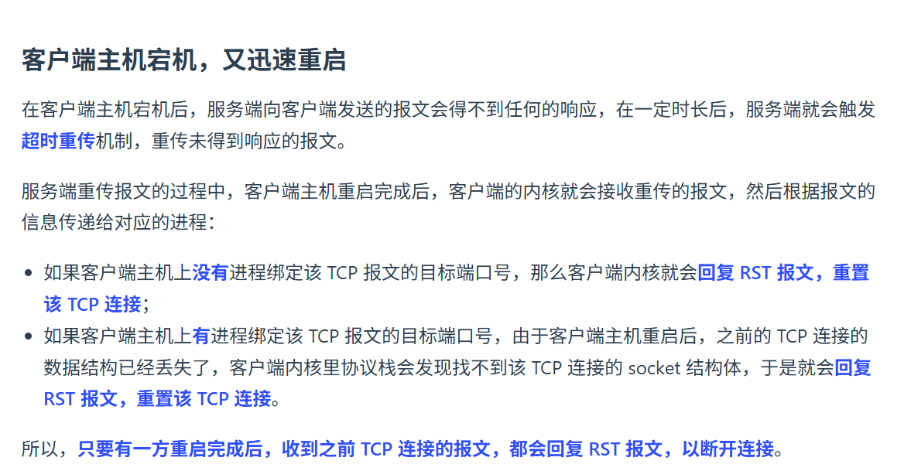
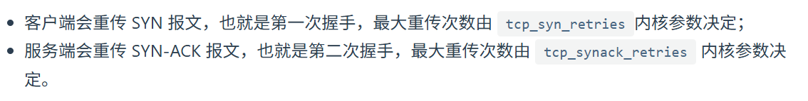
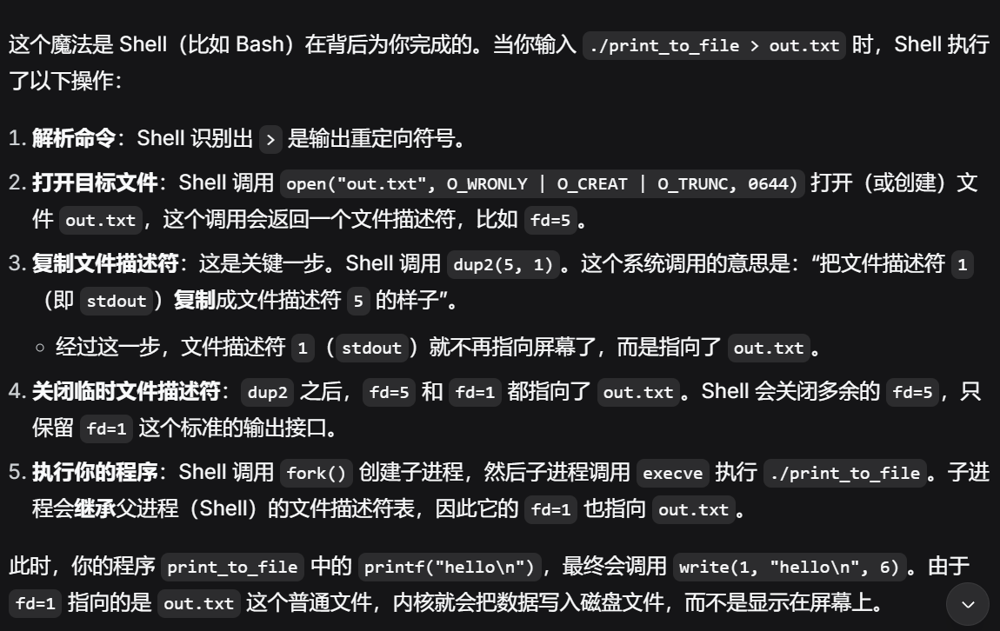
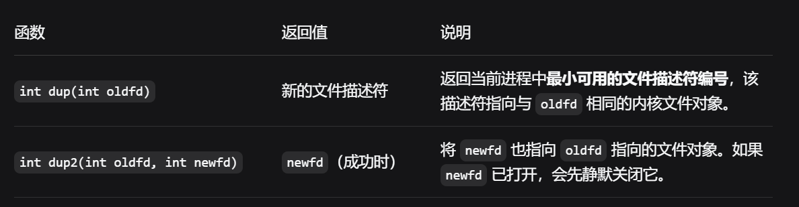
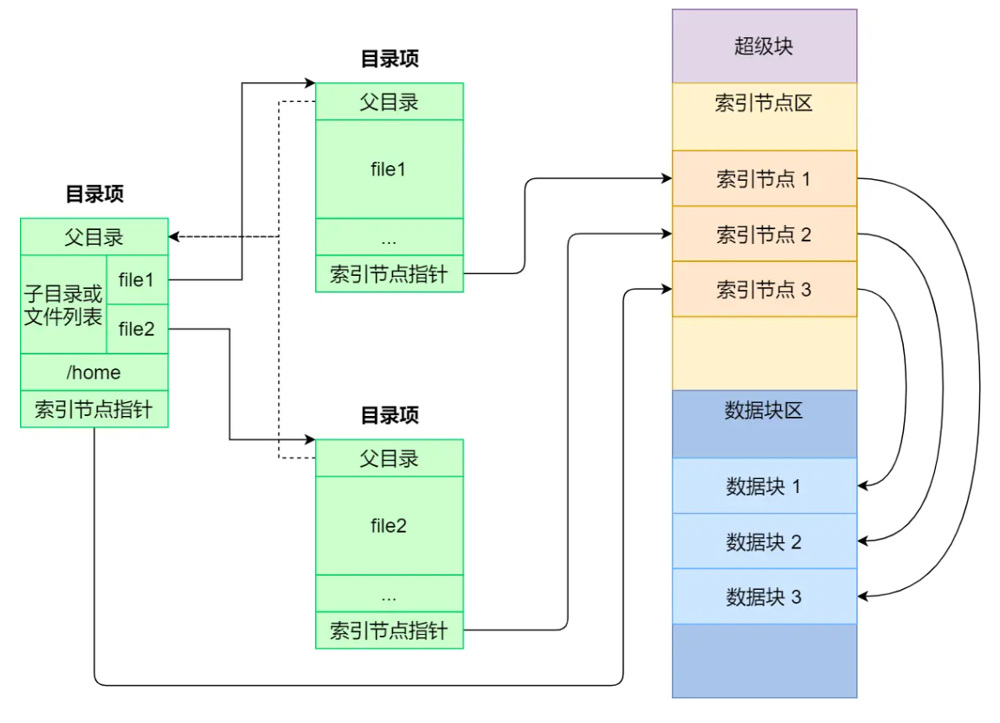
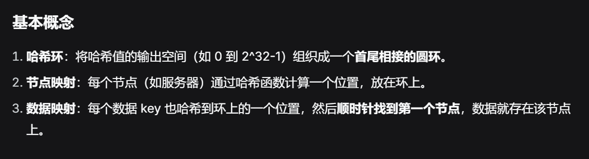
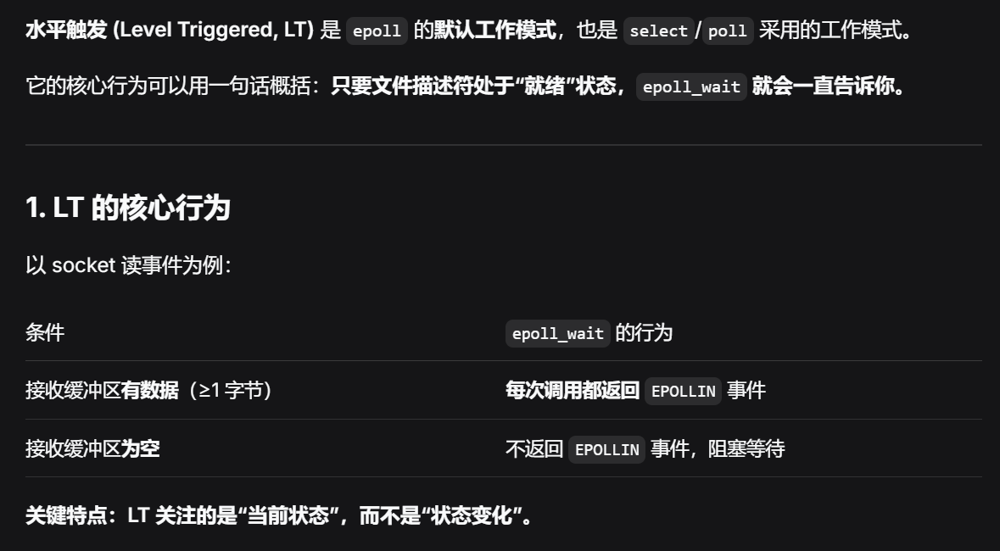

# 计算机网络
## TCP异常连接
### 宕机和进程崩溃

https://xiaolincoding.com/network/3_tcp/tcp_down_and_crash.html#%E8%BF%9B%E7%A8%8B%E5%B4%A9%E6%BA%83

1. 在发数据的情况下

> 如果是进程崩溃，内核可以优雅地和peer完成4次挥手。但是宕机又重启，且有数据传输，会回RST。

> 如果宕机未重启，会超时重传，根据tcp_retries以及RTO，达到阈值后，断开连接

2. 不发数据，就以来KeepAlive报文探查，但需要很长时间。一般上层会进行探查，如http的KeepAlive和KeepAliveTimeout

### 握手丢失
1. 第一次挥手丢失，重传tcp_syn_retries次，Close连接
2. 第二次丢失，双方都会重传

3. 第三次丢失，重传SYN_ACK。注意，接受方（服务端）不需要那个丢失的 ACK 了，只要后续报文没丢，连接就能正常建立。

### 挥手丢失


# 操作系统
## 管道，重定向
### 内核级重定向

可以用dup进行保存，并恢复，当dup2完成后，原来的fd被删除了

### 用户级重定向
```
#include <iostream>
#include <fstream>

int main() {
    // 1. 保存原来的缓冲区
    std::streambuf* old_buf = std::cout.rdbuf();
    
    // 2. 打开文件，把 cout 重定向到文件
    std::ofstream file("output.txt");
    std::cout.rdbuf(file.rdbuf());
    
    // 3. 这个输出会进文件，不是屏幕
    std::cout << "Hello, redirected!" << std::endl;
    
    // 4. 恢复
    std::cout.rdbuf(old_buf);
    
    // 5. 这个输出回到屏幕
    std::cout << "Back to console" << std::endl;
    
    return 0;
}
```
## 文件系统
每个文件都对应有两个数据结构inode和dentry，dentry并不需要落盘，实时创建。

inode不会记录文件名或目录名，dentry用来做文件名到inode的映射。



### 路径查找过程
操作系统启动时 dentry cache 是空的，但仍然能根据路径找到 inode，流程如下：

#### 查找 /home/user/test.txt
1. 根目录 inode
   
   - 根目录 / 的 inode 是已知/固定的，内核直接知道其 inode 号
2. 逐级解析
   
   - 读取根目录文件内容 → 找到 home 对应的 inode 号
   - 根据 inode 加载 home 目录 → 在其内容中找到 user
   - 根据 inode 加载 user 目录 → 找到 test.txt
3. 创建 dentry
   
   - 每解析一层路径，就创建对应的 dentry 并加入缓存
   - 下次再访问同样的路径时就能直接命中缓存

   ### 存储结构
   一般将逻辑块（4KB），分为块组。每个块组内有，超级块、inode表、数据块、块组信息(inode位图、块位图)等。
    注意位图是管理空闲块的。
    对于非空闲块，在Unix中，往往是通过inode的索引结构管理。可能有一二级索引、连续块、隐式链表等。

## 哈希一致性
主要是解决通过hash进行负载均衡的分配时，再迁移过程中，出现的迁移量很大的问题。

原环：
    Node A ──→ Node B ──→ Node C ──→ (回到 Node A)

新增 Node D 放在 Node A 和 Node B 之间：
    Node A ──→ Node D ──→ Node B ──→ Node C ──→ (回到 Node A)

受影响的数据：
    只有原本在环上位于 (Node A, Node D] 区间的 key 需要从 Node B 迁移到 Node D
    其他所有 key 完全不受影响

## IO多路复用
### 边缘触发和水平触发
#### ET
当缓冲区状态从空变成非空时，会触发IO事件。
如果你处理了这次IO，但是缓冲区还有剩余数据。
除非下次通知，否则你并不知道还有数据，就会丢失数据。
#### LT
感觉ET很糟糕，为什么不同LT？



